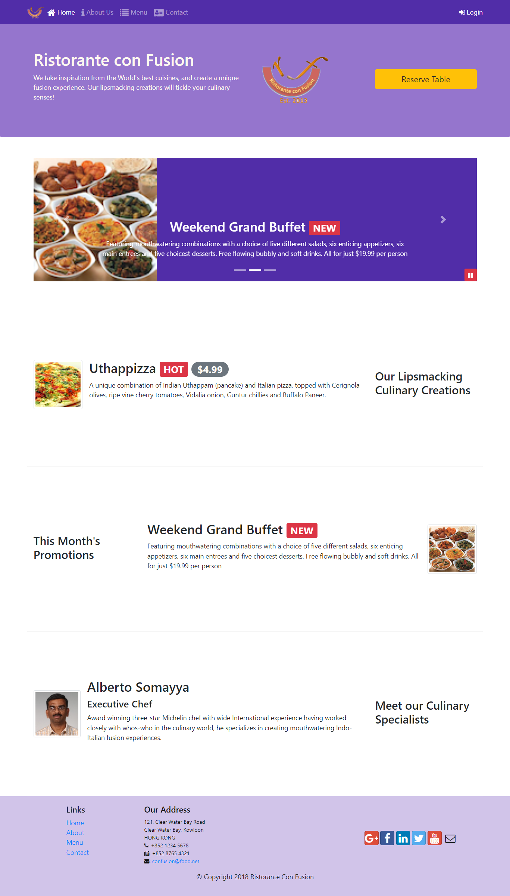
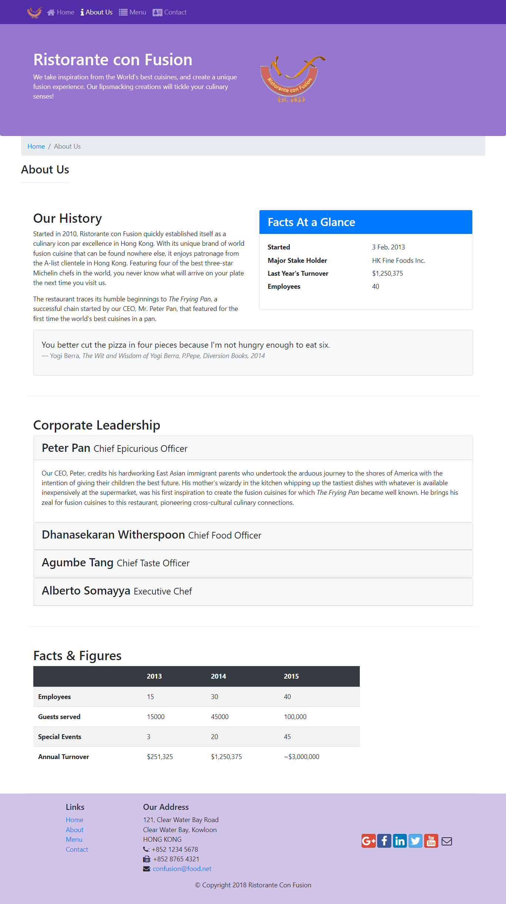
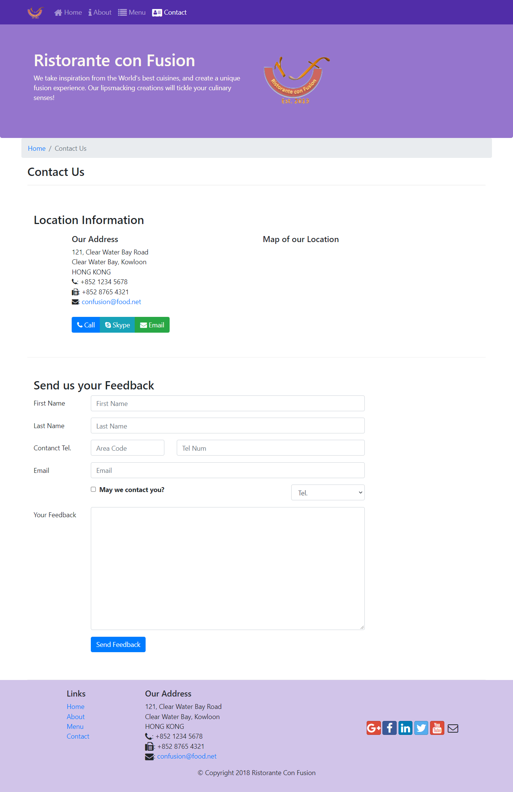
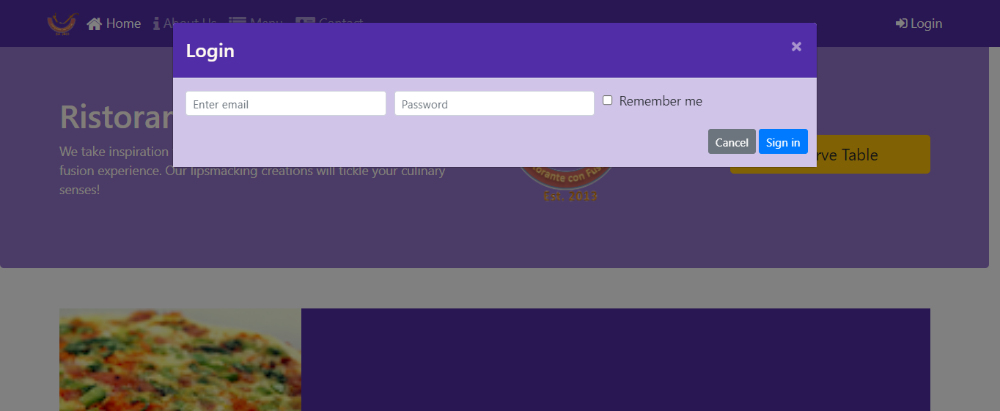
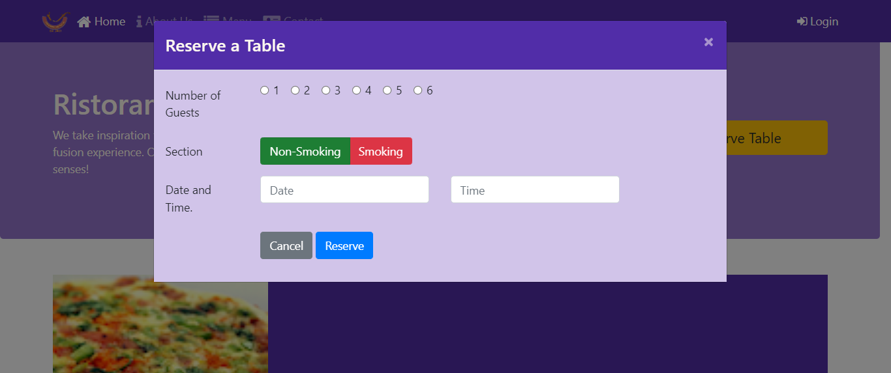

# Boostrap
Website made during the course on Bootstrap in Coursera
This is a website for a Restaurant.
This is made using HTML, CSS and Bootstrap 4.

Preview Images:
Home Page

About Us Page:

Contact Us Page:

Login Modal:

Reserve Table modal:

